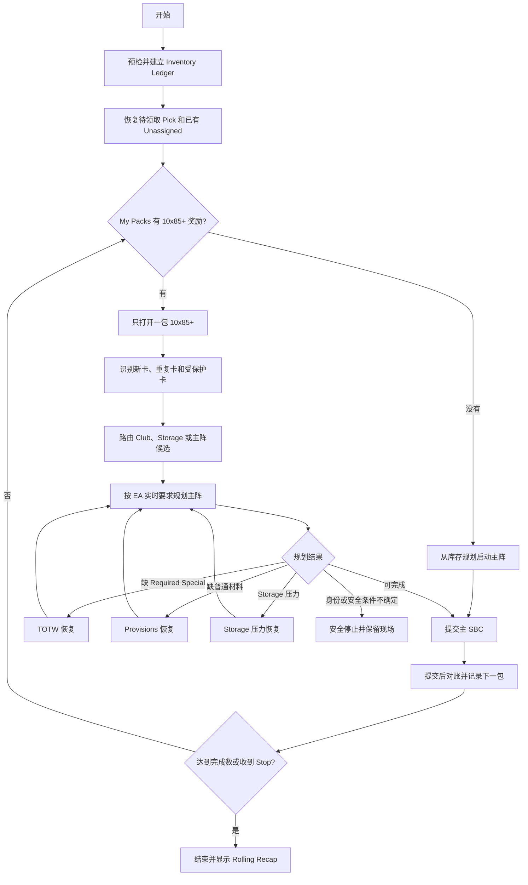
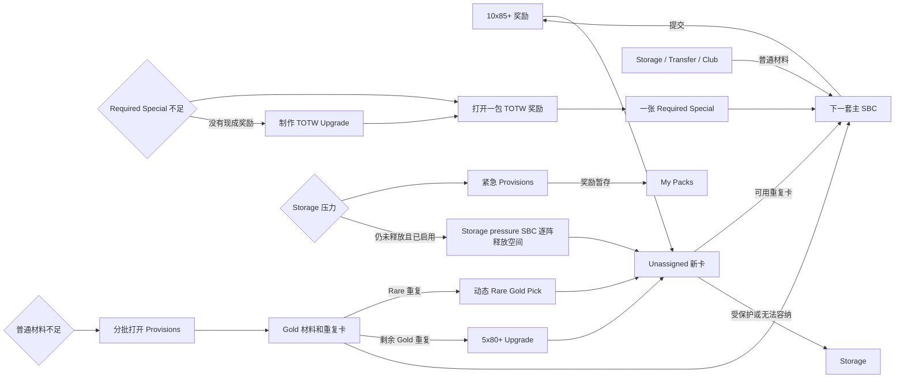

# 10x85+ Rolling Loop 使用与流程指南

> 适用版本：FCAutomationTool `v0.8.40`
>
> 最后更新：2026-08-22
>
> 本文说明实际运行行为。设计决策、测试和实施记录见 [10x85+ Rolling Loop 设计与实施追踪](10X85_ROLLING_LOOP_IMPLEMENTATION_ZH.md)。

## 1. 这个 Loop 做什么

`10x 85+ Upgrade Rolling Loop` 围绕当前 EA 提供的 `10x 85+ Upgrade` 循环运行：

1. 打开一包现有的 `10x85+` 奖励；没有现成奖励包时，先从库存启动一套主 SBC。
2. 将可安全消耗的重复卡回填下一套主 SBC。
3. 从库存补齐人数、评分和一张 Required Special。
4. 提交主 SBC，获得下一包 `10x85+` 奖励。
5. 遇到 Required Special 缺少、普通材料缺少或 Storage 压力时，进入对应恢复流程。
6. 达到 `SBC completions`、用户停止或安全停止条件后结束并显示 Recap。

Loop 不写死当前 Set、Challenge、奖励包 ID、目标评分或阵容人数。启动前会从 EA 实时元数据确认主 SBC 和恢复 SBC；元数据不完整或规则不兼容时不会猜测执行。

## 2. 启动条件和推荐设置

先等待启动扫描完成，并确认 Loop 列表中出现 `10x 85+ Upgrade Rolling Loop`。动态扫描只有同时确认以下事实时才生成该 Loop：

- 奖励是 10 张、最低评分为 85 的高评分球员包。
- 主 Challenge 的人数和目标评分可解析。
- 主 Challenge 恰好要求一张可识别的 Required Special。
- 关键 Set、Challenge 和奖励身份稳定且唯一。

推荐首次运行前检查：

| 设置 | 默认值 | 行为 |
| --- | --- | --- |
| `SBC completions` | `0` | `0` 表示不限轮数，直到手动停止或触发安全停止；正数表示最多完成多少套主 SBC。 |
| `Open reward packs` | 选择 Rolling 时默认开启 | 主流程必须开 `10x85+` 奖励；关闭后启动预检会直接拒绝运行。 |
| `Automatic-use max rating` | `90` | 评分 `<=` 此值的卡可被自动使用；更高评分受保护。它同时用于 Rolling 和 Player Pick。 |
| `Provisions reserve max` | `87-88` | 选择 Provisions 储备范围，可改为 `87-89`、`87-90` 或 `87-91`；默认关闭余量制作时，这些卡仍可优先回填主阵。 |
| `Use Storage first for normal recovery SBCs` | 关闭 | 关闭时，普通 Provisions 和 Required Special/TOTW 恢复按 `Unassigned -> Storage -> Transfer -> Club` 选材；开启后改为 Storage-first。该选项不覆盖待处理 Unassigned 重复卡、Storage pressure 和 Storage maintenance 的专用顺序。 |
| `Provisions packs per shortage` | `2` | 一次真实缺料处理中最多打开多少个已有 Provisions 奖励，范围 `1-30`；每批后重新规划。 |
| `Craft surplus Provisions/TOTW` | 关闭 | 关闭时只在缺料或 Storage 压力下执行恢复 SBC；开启后才主动消耗余量。 |
| `Protect all Club non-TOTW specials` | 关闭 | 开启后，Rolling 的主阵、Storage pressure SBC 和所有恢复阵都禁止使用 Club 非 TOTW 色卡，即使严重缺料也不放宽；Storage、Transfer 和 Unassigned 色卡仍按原有评分及角色限制可用。 |
| `Allow Club current-pool specials for Provisions` | 关闭 | 仅用于普通 Provisions 缺料恢复：普通材料不足时，允许使用当前 EA live matcher 精确认可、评分位于配置 Provisions 范围内的 Club 非 TOTW 色卡。只按精确 item ID 授权，且仍排除 FSU Lock、Evolution、Active Squad 冲突、超保护评分和其它受保护卡；开启上一项严格保护后，本项自动失效。 |
| `Enable experimental native duplicate swaps` | 关闭 | 受控实验开关。关闭时，Unassigned 重复卡先整体送入 Storage，不交换 Club 卡；Storage 不足时安全停止。开启后还必须选择交换范围：`special-only`（特殊卡）、`safe-only`（普通卡）或仅故障调查使用的 `all-eligible`。受控模式每次最多交换一个 pair，未知 fingerprint/交易性/卡种直接留在 Storage。 |
| `Open duplicate Provisions rewards immediately` | 关闭 | 关闭时，由主包重复 Reserve 制作的 Provisions 奖励留在 My Packs，等真正缺料再开。 |
| `Storage pressure recovery` | `Off` | `Automatic` 优先使用兼容的 95+ Pick；`Selected SBC` 只使用用户指定的高评分 Player Pick 或直接球员 SBC。 |
| `Storage pressure SBC` | 扫描目录中的第一项 | 仅在 `Selected SBC` 模式生效；保存后只深度验证选中的 Set。 |
| `Selection mode` | `Rating first` | 控制所有 Player Pick。可改为评分优先并复核受保护同分、特殊卡价格优先，或遇到任何特殊卡都人工选择。 |

`Standard Rating SBC max card` 只控制普通评分 SBC，不限制 Rolling 主阵和 Rolling 恢复阵。Rolling 使用的是 `Automatic-use max rating`。

Rolling 中产生的 Pick 与独立 Pick Loop 共用该策略。`Special price first` 让特殊卡始终排在普通卡前，并跨评分按实时价格排序；高价重复特殊卡挤掉非重复特殊卡或竞争价格缺失时暂停。`Always review specials` 在出现任何特殊卡时暂停。`Automatic-use max rating` 不会覆盖这两种特殊卡策略。

## 3. 主流程



一次正常循环只开一包 `10x85+`。提交主 SBC 后，Runner 先完成库存对账，再进入下一次循环；不会一次打开多包主奖励后才处理重复卡。

## 4. 卡片如何被使用

### 4.1 来源顺序

主阵、待处理 Unassigned 重复卡和默认的普通恢复遵守以下库存优先级：

```text
Unassigned -> Storage -> Transfer -> Club
```

开启 `Use Storage first for normal recovery SBCs` 后，普通 Provisions 和普通 Required Special/TOTW 恢复改为 `Storage -> Unassigned -> Transfer -> Club`。这个选项只改变同一批合格候选的具体来源，不保证增加 Storage 净空位；受保护的 Unassigned 卡仍会被跳过。

Storage pressure 和 Storage maintenance 不读取该普通恢复选项，它们继续使用各自的强制 Storage-first 与净释放校验。兼容的 95+ Storage Pick 继续使用原专用策略：89 阵只使用 Unassigned 和 Storage，88 阵才允许最多 3 张 Club。用户显式选择的通用 sink 使用 `Unassigned -> Storage -> Transfer -> Club`，但 Club 每阵仍最多 3 张，并且提交前必须证明实际释放了所需 Storage 空间。

### 4.2 Required Special

Required Special 是主 SBC 要求的 `TOTW/TOTS/FOF/FUTTIES` 角色，规则如下：

- Unassigned、Storage、Transfer 中由实时 matcher 识别的四类卡可作为 Required Special。
- 主阵中只允许 Club TOTW 进入这个角色；Club 中的 TOTS、FOF、FUTTIES 默认保留。
- `PLAYER_RARITY_GROUP=83` 的成员范围由 EA live item groups 决定。实时 group 83 已覆盖旧 TOTW/TOTS/FOF/FUTTIES 分类之外的特殊卡时，允许使用多张逐卡命中 group 83 的安全特殊卡；不含 group 83 的特殊卡不会被放行。
- 扩展模式只放宽数量，不把 matcher 改成“任意特殊卡”；Evo、cosmetics、超保护评分和 Club 非 TOTW 特殊卡仍受保护。
- 显式开启 `Allow Club current-pool specials for Provisions` 后，只有普通 Provisions 缺料恢复可把评分位于配置范围内的精确 Club current-pool 非 TOTW 实体作为最后候选；它不改变主阵 Required Special 来源，也不作用于 duplicate-reserve、Storage pressure 或其它恢复 SBC。
- 高于 `Automatic-use max rating`、Evolution、交易中或身份不确定的卡仍受保护；开启 `Protect FSU locked players` 后，FSU Lock 卡也会被排除。

### 4.3 普通材料和其它 Special

- 不高于 `Automatic-use max rating` 的安全普通卡可用于主阵。
- Storage 中不高于阈值的非 Required Special 可作为普通材料。
- Club 中的其它 Special 属于最后候选，尽量保留；Club 中匹配 TOTS/FOF/FUTTIES 身份的卡硬保护。
- 开启 `Protect all Club non-TOTW specials` 后，上一条的最后候选层关闭：所有 Club 非 TOTW 色卡都进入硬保护。Club TOTW 仍只能用于 Required Special 槽；该开关不会禁止 Storage、Transfer 或 Unassigned 中可安全消耗的色卡。
- `Allow Club current-pool specials for Provisions` 是更窄的显式例外：只在普通 Provisions 缺料恢复、普通候选无法成阵后，才放行当前 matcher 命中的精确 Club 非 TOTW item；严格 Club 色卡保护优先级更高。
- 高于阈值的重复卡优先移动到 Storage，不会为了继续循环而强制提交。
- loan、limited-use、concept、academy/evolution、active trade item 和同阵 definition 冲突始终排除；FSU Lock 由默认关闭的 `Protect FSU locked players` 控制。

### 4.4 重复卡和实体身份

EA 的 duplicate signal 只表示“存在冲突”，真正提交前还必须解析可提交的 Club 或 Storage 实体。Runner 会核对 item ID、definition、评分、rareflag 和 Evolution/version 特征：

- 同 definition 但评分、rareflag 或 Evolution 版本不同，不会直接认作同版本重复。
- 默认关闭原生交换时，刚开出的 Unassigned 重复卡必须先完整移入 Storage，之后才可作为 Storage 实体进入下一套 SBC。
- 受保护或无法容纳的重复卡转入 Storage。
- 实体身份无法确认时安全停止，不会用名称或 definitionId 猜测替代卡。

`Enable experimental native duplicate swaps` 默认和旧配置迁移值都是关闭。关闭时不会创建新的交换 journal，也不会调用 EA 原生 Club move；如果 Storage 不能一次接收全部重复卡，返回 `DUPLICATE_SWAP_DISABLED_STORAGE_BLOCKED`。若已在 Selection Policy 启用并选定 Storage pressure SBC，Runner 会先尝试紧急 Provisions，再用该 SBC 净消费足够的真实 Storage 卡，确认容量后重试整体 Storage 路由；这批待存 Unassigned 卡不会进入恢复阵，即使其中的 87/88/89 卡属于当前 Provisions Reserve 范围也不会解除保护。候选选择和提交前 validator 分别检查这些 signal；安全 Provisions 不可行时自动继续尝试 Storage pressure SBC。未启用或无法安全释放容量时保留现场且不提交主 SBC。提交前还有第二道 `DUPLICATE_SWAP_DISABLED` 防线，防止任何遗漏路由的 `from:unassigned | submitFrom:club` 阵容继续提交。

关闭开关不跳过上一次已经发生的交换。启动仍先检查旧 journal，恢复或分类原 Club ID，清理完成后才从当前库存重规划。因此关闭后可以恢复普通流程和重复卡流程；Storage 压力恢复不可用、材料不足或无法证明净释放容量时才会继续安全停止。

只有显式开启实验开关后，如果主包中的不可交易重复卡对应 Club 中一张已确认交易状态的同版本卡，而该卡又被选入本次 Rolling 阵容，Runner 才会在提交前执行一次身份交换。Club 副本可以是可交易或不可交易；未知交易状态保持拒绝：

1. 再次核对 definition、评分、rareflag、Evolution 和 cosmetic/version 状态，并确认 duplicate ID 指向当前选中的 Club 实体。
2. 通过 EA 原生的单实体双参数接口 `Item.move(item, CLUB)` 把不可交易版本移入 Club；多对重复卡严格逐对处理，并要求每次响应返回原 Club item ID 到新 Club item ID 的完整映射。
3. 每对交换后立即按完整价值指纹对账并持久化精确新 Club ID，再处理下一对。只用交换后新生成的不可交易 Club 实体替换阵容中的原 Club 实体；原 Club ID 全程受保护，不经过 Storage。
4. 交换后的同 Challenge 重规划可能再次显示 `from:unassigned | submitFrom:club`，但只接受 journal 中精确的原 Club ID B 指向新 Club ID A' 的反向映射。该映射只复用 A' 的提交权限，不会执行第二次 EA move；任何其它 signal、目标或数量都停止。
5. SBC 确认提交后，把原 Club 卡按原交易状态和价值指纹恢复到 Club；提交失败则尝试补偿恢复。Repository 确认 B 位于 Unassigned 时，其位置优先于实体上可能滞后的 `pile` 标量；其它价值身份仍完整校验。

任何身份、版本、响应映射或对账不一致都会停止本次提交。Runner 不会仅凭球员名称或相同 definition 强行交换，因此不会把 EVO、cosmetic 或其它异版本卡当成同一张卡。

同一次运行内，交换、重规划、提交和补偿仍是一个严格事务：提交结果不确定、身份变化或补偿无法对账时立即停止，不会自动重试提交。

页面刷新、脚本更新或重新启动后，不假设上一次阵容、缓存、待提交实体或 SBC 状态仍然存在。启动阶段会取消上一次提交意图，并按 journal 中每个原 Club item ID 的当前状态分别处理：

- ID 已在 Club：保留原位并清除旧 journal。
- ID 在 Unassigned：只移动这个精确 live EA 实体回 Club；对账成功后清除旧 journal。
- ID 在 Storage 或 Transfer：视为停机期间的外部状态变化，保留当前位置并清除旧 journal。
- ID 在全部 pile 都不存在：记录明确的 missing 告警，不用同 definition 卡替代，清除旧 journal。
- 多个 ID 处于混合状态：逐个分类，只恢复仍在 Unassigned 的 ID，不要求整批处于相同状态。
- journal 损坏：记录告警并删除；删除失败或 Ledger 返回不可信的错误 ID 时才阻断。

旧 journal 清除后始终从当前真实库存重新规划，不会续交上次 squad，也不要求上次交换生成的消费实体仍然存在。原 Club ID 的硬保护只约束同一次活动事务；跨启动时，已不存在的实体无法恢复，也不会让过期 journal 永久阻断新运行。

EA 原生交换要求单个 `UTItemEntity` 和 Club pile 两个参数。数组加第三个 `allowStorage` 参数会进入另一条 `untradeableSwap` 路径，可能返回 `status:0` 且库存零变化；Runner 已将重复卡专用路径改为原生双参数调用。维护者可在控制台依次调用 `window.__FCLoopRunner.startNativeDuplicateSwapTrace()`、手动完成一次原生交换、再调用 `stopNativeDuplicateSwapTrace()` 和 `getNativeDuplicateSwapTrace()`；追踪只记录有界脱敏参数/结果，不会替换当前生产交换实现。

## 5. 如何控制主阵评分

目标评分来自当前 EA Challenge 元数据，不固定为 84。规划原则是：

1. 优先纳入当前 `10x85+` 包中可安全使用的重复卡。
2. 从 Storage、Transfer、Club 选择较低材料补齐人数和目标评分。
3. 如果强制纳入的重复卡使阵容高于目标，从非 Required Special 的最高评分重复卡开始逐张移出，再用低分材料替换。
4. 被移出的高分重复卡在提交后进入 Storage。
5. 降评分过程中不会加入第二张 Required Special。
6. 所有重复卡都放宽后仍无法安全达到目标时，停止并报告 `SQUAD_RATING_EXCESS`，不会提交明显过高的阵容。

Runner 追求满足 EA 的准确目标评分，但不会为了精确评分牺牲受保护卡或破坏 Required Special 角色。

## 6. 哪些包会被打开

启动 Rolling 不会预先清空历史 Provisions、TOTW 或 5x80+ 奖励。已有恢复包只有在对应缺料分支被真实触发时才会处理；正常情况下先寻找或制作一包主 `10x85+` 奖励。

任何缺料恢复包在打开前都先运行 Unassigned 清理事务。若当前 Unassigned 因 Storage 已满而无法安全路由，Runner 不会打开该包，也不会继续打开下一个恢复包：启用了 `Storage pressure recovery` 时，先用当前 Unassigned/Storage 完成一次已验证的 Storage pressure SBC，重新对账后再重试同一个包；未启用或无法释放足够空间时，保留该包并安全停止。此规则同时适用于已有 Provisions/5x80+、本轮新制作的 Provisions/5x80+ 和 Required Special/TOTW 恢复奖励。

| 奖励 | 触发时机 | 每次处理量 | 打开行为 |
| --- | --- | --- | --- |
| `10x85+` 主奖励 | 每个主循环 | 一包 | 必须打开；处理完该包和下一套主阵后才开下一包。 |
| 已有 TOTW Upgrade 奖励 | 缺 Required Special | 一包 | 每次只开一包，然后重新扫描和规划；不会先清空所有 TOTW 包。 |
| 新制作的 TOTW Upgrade 奖励 | 已无现成 TOTW，且成功制作 | 一包 | 立即打开，以取得主阵需要的 Required Special。 |
| 已有 Provisions 奖励 | 已确认普通材料不足 | 默认最多两包 | 按 `Provisions packs per shortage` 分批打开；每包产生的重复卡先处理，每批后重新规划主阵。 |
| 缺料时新制作的 Provisions 奖励 | 现有恢复包仍不足 | 一包 | 立即打开，因为本次制作就是为解决当前缺料。 |
| Storage-pressure Provisions 奖励 | 为释放 Storage 而制作 | 一包 | 保留在 My Packs，不立即打开，避免再次增加 Unassigned 压力。 |
| duplicate-reserve Provisions 奖励 | 开启余量制作，且主包 Reserve 凑够一套 | 一包 | 默认保留；只有启用 `Open duplicate Provisions rewards immediately` 才立即打开。 |
| 动态 Rare Gold Player Pick | Provisions 奖励产生 Rare Gold 重复 | 按可完成情况 | 仅绑定明确不限次数的单阵、单选 Pick；完成后立即领取并使用现有自动 Pick 逻辑。 |
| `5x80+` | 恢复奖励产生剩余 Gold 重复 | 按可完成情况 | 作为重复 Gold sink；新奖励进入当前恢复处理，已有遗留奖励只在真实缺料时处理。 |
| `1 of 3 95+ ... Player Pick` | Storage 压力且显式启用 | 完成两阵后一次 | 两阵都完成后立即领取；不会留下待领取 Pick 再打开主包。 |

## 7. 恢复流程

### 7.1 Required Special 不足

```text
扫描 Unassigned / Storage / Transfer 中符合 matcher 的卡
-> 扫描 Club 中可用 TOTW
-> 仍不足：打开一包已有 TOTW Upgrade 奖励
-> 重新规划主阵
-> 仍不足且没有现成奖励：制作一套 84+ TOTW Upgrade
-> 如果 TOTW SBC 自身缺普通材料：进入 Provisions 恢复
```

每打开一包或提交一套后都会重新读取库存。这样可以在刚取得一张合格 TOTW 后立即回到主阵，不会继续无意义地开 TOTW 包。

### 7.2 普通材料不足

```text
主阵规划确认人数或评分不足
-> 打开最多 N 包已有 Provisions 奖励
-> Rare Gold 重复优先进入动态 Rare Gold Pick
-> 其余 Gold 重复进入 5x80+
-> 重新规划主阵
-> 仍不足：处理下一批，或制作一套新的 Provisions
```

`N` 是 `Provisions packs per shortage`，默认 2。它限制单次缺料批次，不代表启动时清空所有历史 Provisions 包。只有主阵规划实际返回材料不足，才会触发这个流程。

Rare Gold Pick 不绑定固定奖励评分或固定成本。动态扫描只接受明确不限次数、恰好一个 Challenge、只选择一张奖励、全部材料为 Gold 且至少要求一张 Rare Gold 的 Pick。候选按“最低 Rare Gold 数量升序、总 Gold 数量升序、奖励最低评分降序、候选数量降序”排列。例如 `4 Rare` 优先于 `6 Gold/至少 4 Rare`，后者又优先于 `6 Rare`。最佳候选无可用 Challenge 时尝试下一候选；全部不可用才回退到 `5x80+`。

扫描中的 `repeats:0` 才算明确不限次数；正数属于有限次数，缺失或 `null` 属于 unknown。有限或 unknown Pick 仍可作为独立动态 Loop，但不会进入 Rolling 恢复链。实际提交前会再次检查 live Set，防止旧扫描结果误用已经变化的活动。

制作 Provisions 时，材料评分严格限制为配置的 `87-88`、`87-89`、`87-90` 或 `87-91`，不会因为不足自动越过上限。Required Special 默认排除；只有显式开启 `Allow Club current-pool specials for Provisions` 的普通缺料恢复，才可在普通候选不足后使用范围内、live matcher 精确批准的 Club 非 TOTW item。符合范围的 Club Other Special 仍只作为最后候选，全部锁定、Evolution、Active Squad 和评分保护继续生效。

### 7.3 Storage 压力

Storage 满或无法容纳待保护的高分重复卡时：

1. 先尝试紧急 Provisions，但提交计划必须实际消耗足够数量的 Storage 卡并释放当前所需位置；扩展 group 83 时，85x10 和 Provisions 都可以在同一批次使用多张实时 matcher 精确批准的 Storage 特殊卡。
2. 如果只能从 Club 补出 Provisions、无法改善 Storage，判定该路径无效；不会连续制作 Provisions。
3. 紧急 Provisions 的奖励留在 My Packs，不在高压状态下打开。
4. 若仍无法释放空间且启用了 `Storage pressure recovery`，进入已解析的 Storage pressure SBC。
5. 若 capability 不可用、用户未启用或材料仍不安全，停止并保留 Unassigned 现场。

Storage pressure 有三种模式：

- `Off`：不执行该恢复路径。
- `Automatic`：从已深度验证的候选中选择；为兼容旧行为，当前 95+ 双阵 Pick 优先。
- `Selected SBC`：只使用保存的 Set ID。Set 过期、完成或要求变化时保持 unavailable，不会静默切换到其它 SBC。

下拉目录来自轻量 `requestSets()` 索引。Player Pick 会先完成现有动态扫描，只有至少包含一阵 87+ 才会显示；奖励评分不参与筛选。直接球员 SBC 可以先以索引候选显示，用户保存显式选择后 Runner 只加载该 Set 的 Challenge 元数据；不会为生成下拉列表而深扫所有球员 SBC，以免增加 EA 请求和 429 风险。最终候选必须至少有一阵 87+；纯 Pack、Chemistry 或当前评分规划器不支持的要求会拒绝。

95+ 双阵按顺序而非联合提交：

- 先做 89 阵：优先消耗当前待处理的 Unassigned 和 Storage，不使用普通 Club。
- 提交 89 阵后立即对账并重新读取 Challenge 状态。
- 再做 88 阵：先使用 Storage，确实不足时最多加入 3 张安全普通 Club 卡。
- 89 已完成但 88 暂时不可行时，记录 `STORAGE_SINK_88_DEFERRED`；以后再次出现 Storage 压力时只继续 88 阵。
- 两阵完成后立即领取 Pick、处理结果，再重试原来待存入 Storage 的卡。

其它显式选择的高评分 SBC 使用通用逐阵流程：

- 每次 Storage pressure 只提交评分最高的一阵，其余阵容留到以后再次出现压力时继续。
- 必须优先容纳可自动使用的 Unassigned 阻塞卡，再使用 Storage、Transfer，最后最多 3 张安全 Club 卡补评分。
- 每阵独立验证实际消耗的 Storage 卡数量；只靠 Club 补满但不释放空间时不会提交。
- 子阵奖励 Pack 只留在 My Packs，不在 Storage 高压阶段开启。
- 最后一阵是 Player Pick 时立即自动处理 Pick；直接球员奖励优先路由到 Club，真正重复时使用提交前预留的 Storage 槽位。
- 低于 87 的剩余阵容不会作为 Storage pressure 阵提交，因此通用 sink 可能只完成球员 SBC 的高评分部分。

## 8. 包和材料循环图



## 9. 可选余量制作

`Craft surplus Provisions/TOTW` 默认关闭。关闭时：

- 不会因为启动扫描发现 87/88/89 就主动制作 Provisions。
- 不会在每套主 SBC 后主动清理 Storage。
- 85-89 的可用重复卡优先参与下一套主阵。
- 真正缺料、Required Special 不足和 Storage 阻塞时的必要恢复仍然有效。

开启后增加两类主动动作：

- 当前主包中符合所选 `Provisions reserve` 的重复卡凑够一套时，可以立即制作 Provisions；奖励是否马上打开由独立选项控制。
- 主阵提交并完成对账后，Storage 中完整的 87/88 组可制作 Provisions；符合维护条件的 `<=86` 和 89 材料可用于 TOTW Upgrade。维护 Provisions 奖励默认保留，TOTW 奖励会打开。

该选项会显著增加恢复 SBC 数量。它用于主动整理余量，不是 Rolling 能否在缺料时恢复的总开关。

## 10. 运行状态和 Recap

Rolling 运行时在主面板显示独立状态区：

- 当前 Phase 和 Cycle。
- `Special slots`：当前可用于主 SBC 特殊槽的数量。
- `Storage Pressure SBCs`：本次运行已明确提交的 Storage Pressure SBC challenge 数量。
- `Provisions batches`：当前估计可完成的 Provisions 批次。
- `TOTW SBCs`：本次运行已明确提交的 TOTW SBC 数量。
- `Storage`：已用容量和总容量。

`Storage Pressure SBCs` 和 `TOTW SBCs` 只在 EA 明确确认提交后递增；规划、失败、取消、仅打开奖励或结果不明确都不会计数。库存每次开包、提交、移动和对账后都会增量更新。

Rolling Recap 使用有界聚合，不会无限保存每一轮全部卡片：

- 主 SBC 完成数、迭代数和 bootstrap 次数。
- 主包和恢复包打开数量。
- TOTW、Provisions、Rare Gold Pick、5x80+、Storage pressure SBC 次数。
- Common、Rare、Special、重复卡数量和评分分布。
- 重复卡进入 Primary、Storage、Recovery 的数量。
- 最高评分卡和命中 Reward Alert 的 Special 卡。
- 最终资源摘要及停止 Phase/reason code。

最多保留 50 张最高评分卡和 100 张 Alert 卡的详情，其余只计入统计。符合 Reward Alerts 设置的 Special 仍会触发页面高亮、桌面或 ntfy 通知。

## 11. Stop、失败和恢复

- `Stop` 是请求在下一个安全边界停止，不会故意中断已提交但尚未对账的事务。
- 如果在开包清理阶段停止，已开出的卡可能暂时留在 Unassigned。
- 下次启动同一个 Rolling Loop 时，先恢复待领取的 95+ Pick 和现有 Unassigned，再决定是否打开下一包主奖励。
- 如果 EA 以 `409` 返回非空 `itemViolations`，且每个被警告 item ID 都能严格对应当前已保存阵容中的实体，Rolling 在 `Protect Active Squad players` 关闭时会对同一阵容执行一次 `skipValidation:true` 确认提交。这用于处理“球员仍在现有阵容”等 EA 可确认警告；该设置默认关闭。
- 开启 `Selection Policy -> Submission guards -> Protect Active Squad players` 后，普通卡不再阻塞整次运行：Runner 记录冲突的精确 item ID、在当前 Rolling 运行内排除它并重新规划；不会按 definition ID 排除同版本的其它实体。新一次 Rolling 会清空这份临时排除列表。
- 特殊卡按来源和角色分流：Unassigned/Storage/Transfer 的 TOTS/FOF/FUTTIES 可以正常填入 Required Special 槽，但不属于 Active Squad 确认候选。若 EA 对其中任何一张返回 `409/itemViolations`，说明 EA 实体身份或规划状态矛盾，立即报错且不允许强制提交。`Protect all Club non-TOTW specials` 不改变这条硬规则；它只让其它 Club 非 TOTW 特殊卡成为最后 fallback，此类 Active Squad 冲突在开关关闭时显示 `Use this card` / `Replace card`，开启时按规划回归报错。
- 对合法特殊卡选择 `Use this card` 时，只对当前保存阵容执行一次有界 `skipValidation:true` 确认；选择 `Replace card` 或点击弹窗外部时，按精确 item ID 排除并重规划。本次运行内已批准的实体不重复询问。
- Rolling 的 Provisions、5x80、TOTW 等库存恢复 SBC 与主评分提交使用同一套后台 DAO 提交事务。Challenge 也通过 DAO 直接加载，不再打开 SBC Squad 页面或点击页面 Submit，因此不会触发 FSU 的 `Priceless player tips` 价格确认弹窗。后台提交仍会先刷新/交换实际球员、保存阵容并运行保存前后校验。
- `Protect FSU locked players` 仍然有效：选材过滤和最终阵容校验都会检查 FSU Lock。`Protect Active Squad players` 也仍然有效；关闭时只允许对严格匹配当前已保存阵容的 EA `409/itemViolations` 做一次确认提交，开启时执行上述换卡、复核或保护回归分流。后台提交不是关闭这些保护。
- 缺少 `itemViolations`、响应结构异常、包含阵容外 item ID、已经确认过一次或确认提交仍失败的 `409` 都保持失败；普通 Loop 不启用该确认路径。
- 发生错误后不要先手工移动待处理卡；优先使用 `Save log` 保存完整日志。实体状态被手工改变后，Runner 可能因为无法证明原计划仍有效而安全停止。
- 常见安全停止包括身份/version 不确定、Storage 无可验证空间、目标评分无法安全达到、恢复 capability 缺失和 EA 提交状态无法确认。

## 12. 建议的首次验证方式

1. 先把 `SBC completions` 设为 `1`。
2. 保持 `Craft surplus Provisions/TOTW` 关闭，并将 `Storage pressure recovery` 设为 `Off`。
3. 保持默认 `Automatic-use max rating = 90`，确认高分重复卡进入 Storage。
4. 检查日志中的 live target、Required Special matcher、最终选卡来源和提交后对账。
5. 再分别测试普通缺料、Required Special 缺少和 Storage 高位场景。
6. 确认基础循环稳定后，再启用 Storage pressure SBC 或主动余量制作。

发生异常时，将 Active Profile、Selection Policy、起始 My Packs/Unassigned/Storage 状态和完整 Save log 一并记录。通用排查方式见 [故障排查指南](TROUBLESHOOTING_ZH.md)。
